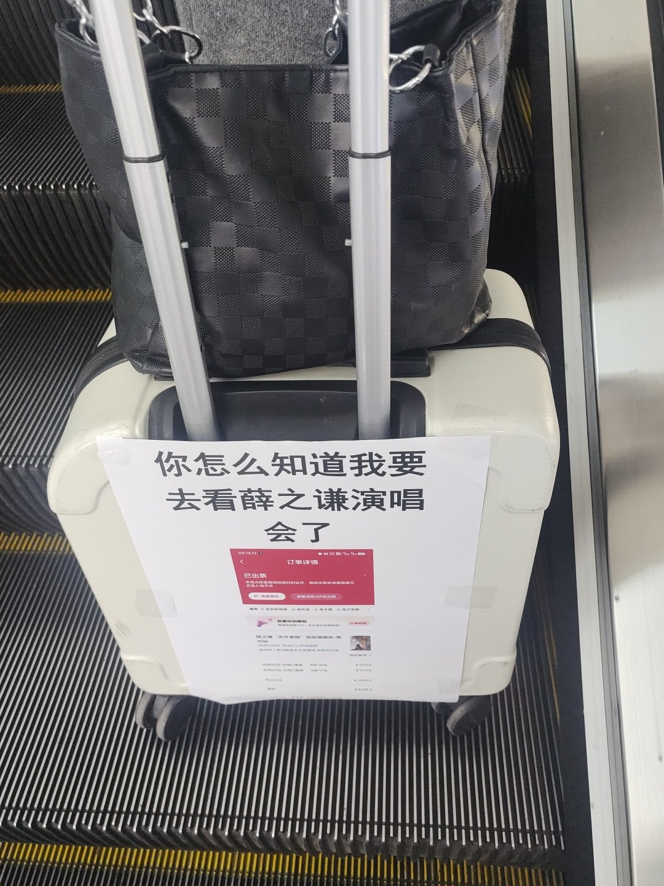
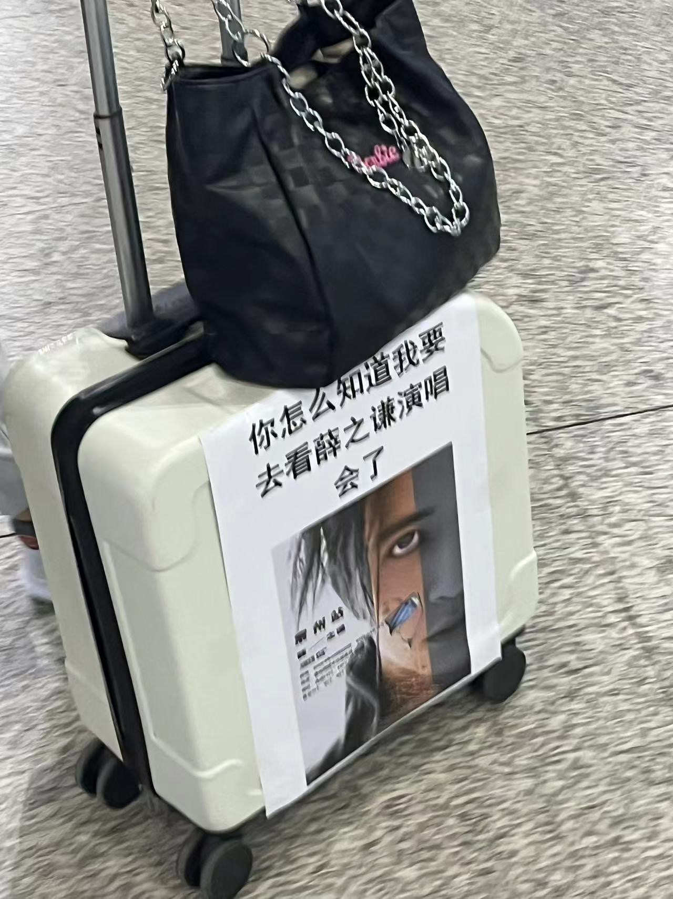
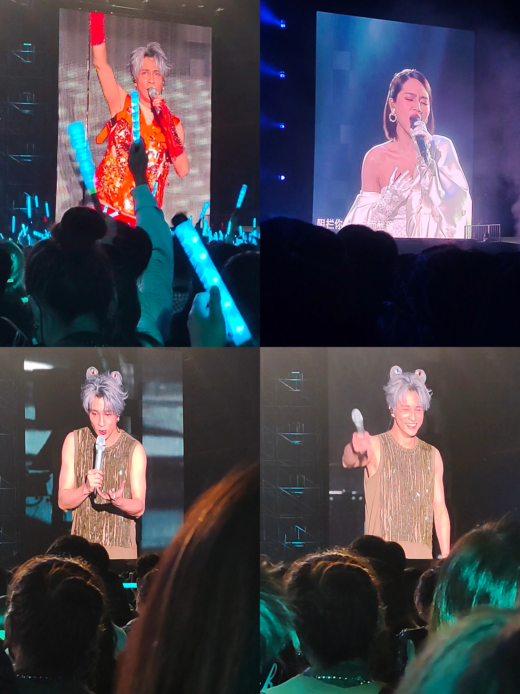
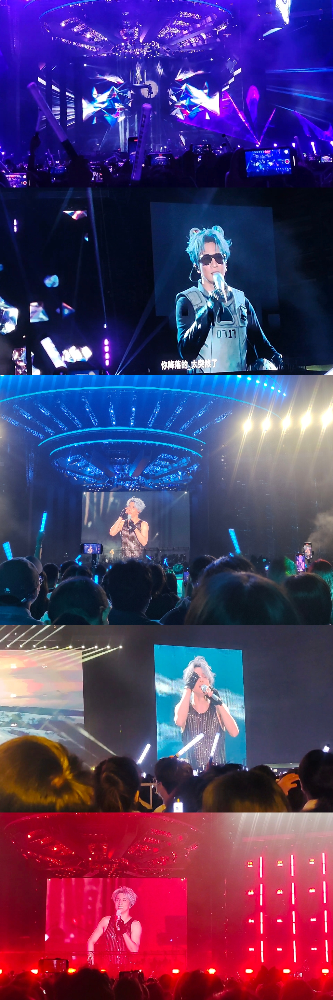
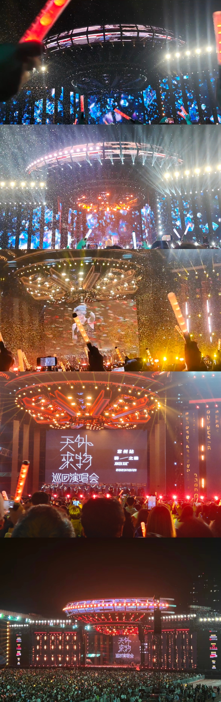

# 天外来物世界巡回演唱会

## 人生的第一次演唱会

说实话，在我的24岁生日之前，我从来没有看过演唱会。以前非常喜欢周杰伦，梦想就是能够攒钱去看一次他的演唱会~
自从2023年3月18日，老薛的三巡演唱会在浙江衢州重启起来，那阵子在大麦、抖音上面非常火，大家都如愿以偿地抢到了门票然后奔赴一场场的巡演。
那时候的我，还在阿里工作吧，那阵子正好我特别喜欢听一首老薛的歌，叫做**《天外来物》**，循环播放的那种。于是乎，正好在我的一次偶然下，我看到了大麦网上开始了预热，薛之谦天外来物巡回演唱会——常州站，将会在 <u>2023.10.20~2023.10.21</u> 在**江苏常州**降落。之前自己也试过抢一些别的地方的票，比如安徽滁州站，但是距离还是有点远吧感觉最终还是退票了。这次想着正好是我的生日，也当是给自己的生日礼物吧，所以我抱着必抢的决心，和我的女朋友一块开抢。人在公司，心已经在常州。

## 一次意外的惊喜

下午 *17:17* 开售，不出意外的，一开始准备的 *717×2* 早就售罄了，于是乎我还是在疯狂乱点，哪里亮了点哪里。不管什么价位段的，1317还是1717。
那是我第一次真心特别想去的一次演唱会，我想听一次天外来物的现场版。

终于，功夫不负有心人。在我坚持了将近5分钟后，我抢到了1317的两连坐。当时其实我是非常激动的，因为我知道我将迎来我人生的第一场演唱会。
也算是我最爱听的歌手之一吧。我记得那时，我和我的女朋友还说：我也没抢到。想着可以给彼此一次意外的惊喜。于是乎我也装作没抢到的样子，一直瞒着只有自己知道这个令人激动的消息。

## 演出前一周

我准备了一个惊喜，把这个消息告诉了她。我的本意是希望可以一块过一个有意义的"我的生日"。因此也算是舍得了一把花了2.6K去看一次演唱会~
我们彼此都很激动，这对于当时的我们来说都是一次**未知的“冒险”**，我坚信，这次的演唱会一定是是我人生当中最难忘的一次**“旅行”**之一。

## 显眼包出发

必须给我彩印，最大号的高清打印出来

## 0717号飞船

当我第一次踏入常州奥体中心的时候，仿佛那是脱离现实生活的三个小时，我无比的放松和开心，精神世界在那一刻达到了一个小小的高潮。
当我听到第一句"你像天外来物一样~求之不得"的时候，情绪还是蛮激动的，倒也不是说眼泪汪汪（因为我到后面才有一点），有一种久违的感觉，听习惯了耳机里面的《天外来物》。第一次听到live版的那一刻，无比珍贵。

至今距离天外来物已经过去了一年半有余，我仍然偶尔会想起那一晚。这将会是我人生非常真贵的一段记忆。

在那之后，我还剪了一段“天外来物”的ending合集：

[天外来物ending合集](https://www.bilibili.com/video/BV1xy421B7rf?t=1.2)

## 演唱会拍的

下次有机会再见，0717号执行官🛸，respect！！！

