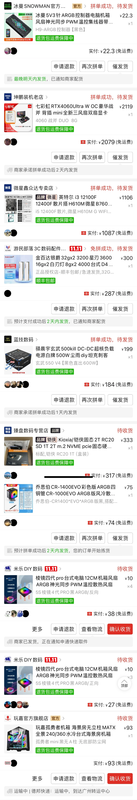
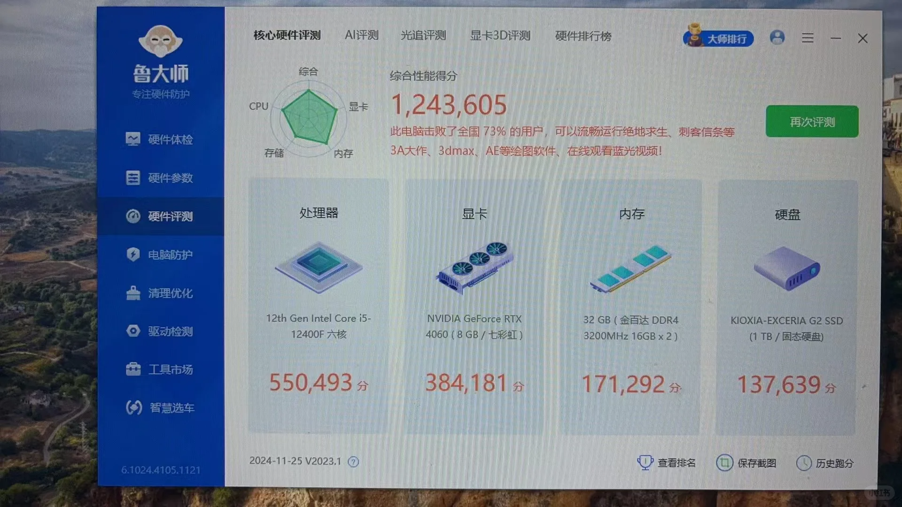

# 分享自己人生的第一台DIY主机
4K！124w跑分！主机！来了！

## 背景
计算机专业但一直不太懂硬件，只是一个普通的程序猿
1. 需要有一台在家的主机，不然每周都要背电脑、换电脑很麻烦
2. 自己的游戏本搬公司去了，家里没电脑的话实在是很不方便

## 心理活动
最开始自己也担心不会装，趁着**双11**打算买整机，看来看去自己的预算标准被不停的拉高。
而且网上购机水比较深，很多杂牌的一些硬件都不标注品牌给你上，很多DIY主播打着良心配置的旗号最终目的还是坑小白（我也是小白），最后坚定决心自己装，预算不过度拉高。
而且之前有一个朋友和我说过一句：<u>你可是计算机专业的，电脑还不会搞吗</u>？男人的竞争力就是这么强，那我就自己装一个逝世

## 选购配置
自己从小红书看配置，选配置，小红书搜DIY主机基本上很多帖子
（而且大部分都是一些DIY的博主，给的配置还是比较靠谱的）
看完后咨询一些小红书博主帮忙看下有无问题
最终确定配置，列清单
各家购物平台比价，我都是来源pdd
想法设法叠加优惠券，性价比最大化
安心等配置送达

## 装机
配件全部到齐花了 4 天左右，散热器是东北发货的所以等了晚一天，建议买的时候看一下发货地尽量一起到

在装机前，看过B站**硬件茶谈、赵德柱**的详细视频，清楚大概流程、装机顺序
周日开始装机，跟着视频操作，全程小心翼翼，总计花费**6个小时**左右完成点亮，进入bios界面，一次成功！

然后装系统，分区，跑分

## 最终效果

## 注意点
- 防呆口不防傻，切勿大力出奇迹。有问题就多查一查怎么解决
- 各个硬件不要遗漏，我就是装完发现主板自带的wifi网卡没装，又把显卡拆了重装
- 网上的教程很详细很详细，都把饭喂你嘴里了，新手也不用特别害怕，找人装也行（大概也就100+价格），看自己选择

## 详细配置清单
- **【CPU】**Intel i5-12400F
- **【主板】**MSI微星 H610M-G DDR4 WIFI
- **【内存】**金百达银爵 3200 三星颗粒 16G * 2根
- **【显卡】**七彩虹 RTX 4060 8GB 战斧
- **【硬盘】**铠侠RC20 1TB
- **【机箱】**玩嘉 孤勇者 mini 黑色 无立柱
- **【电源】**玄武550 V4 600W直出
- **【散热器】**乔思伯 CR1400 EVO ARGB 黑色
- **【机箱风扇】**棱镜4pro * 7 把 + 集线器
