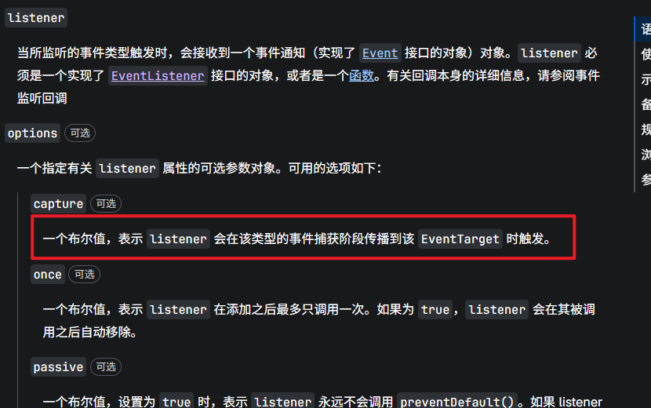

# 浏览器事件机制的实现
## 背景介绍
事件处理是我们在开发过程中使用频率最高的一种机制，它可以帮助我们实现交互效果，提升用户体验。
最常用的点击按钮提交表单、点击地图打开弹窗等等都需要鼠标点击事件的触发，......

浏览器对 DOM 事件的绑定和派发遵循一套标准化的底层逻辑，主要基于**事件捕获（Capture）**和**事件冒泡（Bubbling）**两个阶段，其核心规范是<u>DOM Level 3 Events</u>

## 🧩第一阶段：事件注册（Event Registration）

事件注册一般通过`addEventListener`方法来实现，它的语法如下：
```javascript
element.addEventListener(event, function, options)
```
当然它还可以通过dom元素直接绑定事件，直接在html元素上绑定事件，例如：
```html
<button onclick="alert('hello world')">点击我</button>
```
多个元素可以绑定同一个事件处理函数，同样的一个元素也可以多次绑定多个不同的事件处理函数。
## 🧩第二阶段：点击触发与事件派发（Event Dispatch）
1. 检测用户输入（硬件层）：用户按下鼠标左键，操作系统检测到输入设备事件；并将此事件传递给浏览器进程。
2. 命中测试（Hit Testing）：浏览器根据触发位置（屏幕指针坐标），确定最顶层、可交互的DOM元素。这个元素就是事件的`target`。
3. 创建事件对象（Event Object）：浏览器创建一个 MouseEvent 实例（或其他事件类型），并设置一些关键属性值（target、bubbles、cancelable等）。
4. 构建事件路径（Event Path / Event Flow）
浏览器从 event.target 开始，向上遍历 DOM 树，直到 window，收集所有祖先元素，例如：
```javascript
[
  window,
  document,
  html,
  body,
  div#container,
  button#myBtn  // <-- target
]
```
5. 事件派发的三个阶段

- **阶段1：事件捕获阶段**（目的是让外层容器有机会在事件到达目标前“拦截”或预处理）
事件从 window 开始，向下遍历 DOM 树，检查其上是否有对应（例如click）的事件监听器，且`capture`属性为`true`，如下图所示
其实`capture`属性为`true`代表的意思就是你希望listener在事件捕获阶段就执行，而不是在事件冒泡阶段执行。

如果有，执行该监听器，设置`eventPhase = 1 (CAPTURING_PHASE)`，`currentTarget`为当前元素。
一直传递到<u>目标元素的直接父元素</u>，到此停止。

- **阶段2：目标阶段**：事件到达目标元素，触发绑定的事件处理函数。
eventPhase = 2 (AT_TARGET)
执行 target 元素上所有 click 事件监听器，无论`capture`是`true`还是`false`。
currentTarget 始终是 target 元素。
注意：如果事件的`bubbles: false`（如 focus 事件），则派发在此阶段结束后**直接结束**，不进入下面的第三个阶段：冒泡阶段。

- **阶段3：事件冒泡阶段**：事件从目标元素开始，向上遍历 DOM 树，触发所有绑定的事件处理函数。
方向：从target目标元素到window，依次向上遍历
检查每个元素上面是否有click的事件监听器，且`capture`属性为`false`，
如果有，执行该监听器，设置`eventPhase = 3 (BUBBLING_PHASE)`，`currentTarget`为当前元素。
一直传递到 window 结束。

6. 事件处理函数的执行
在上面的事件派发的三个阶段中，每当符合事件类型、并且条件满足的时候，浏览器进程就会执行`listener`函数。并传入`event`对象。

7. 事件完成
事件处理函数执行完毕后，事件完成。
如果没有调用 preventDefault()，浏览器执行默认行为（如<u>表单提交、页面跳转、文本选中</u>等）。
内存中的 event 对象被标记为可回收。