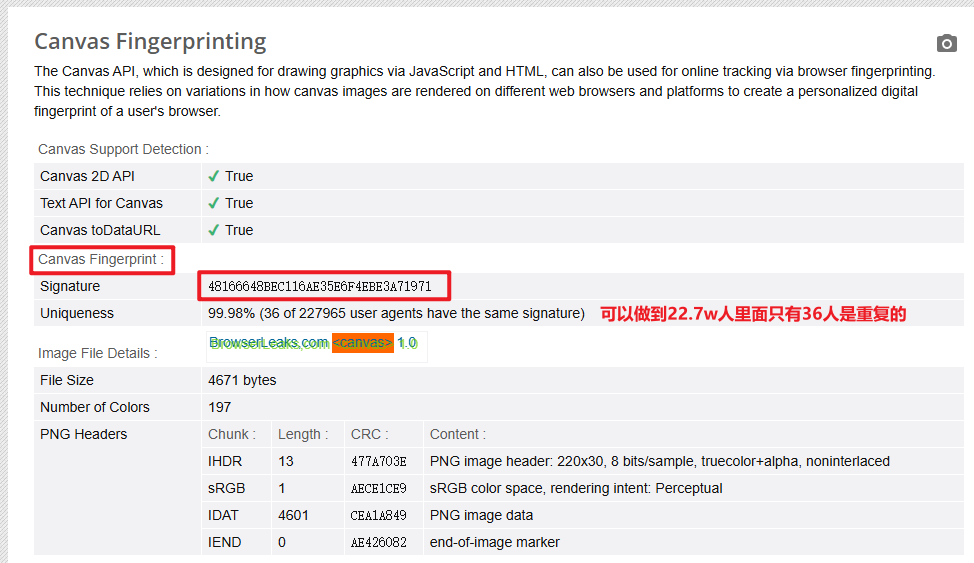
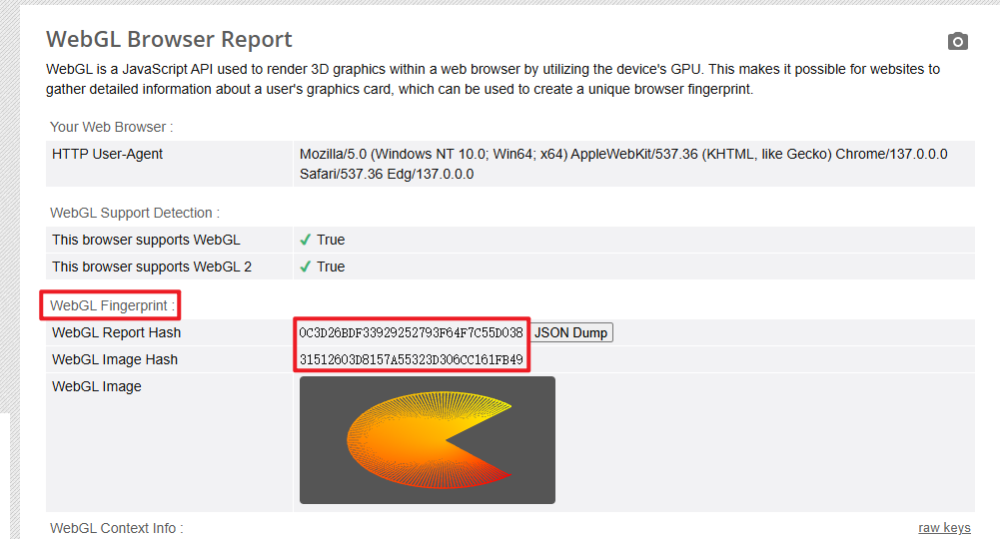

# 浏览器指纹
## 背景
首先我们都知道，当我们登录某个网站（例如淘宝京东等），会精准推送给我们喜欢的商品，这是怎么做到的呢？
毫无疑问，因为我们登录了我们的账号，淘宝京东会根据**我们的账号信息**来判断我们是谁，从而推送我们喜欢的商品、以及历史浏览过的商品。
那么当我们<u>没有登陆任何账号</u>的时候，我们发现也会推送一些我们感兴趣、经常观看的视频，这又是怎么做到的呢？
——答：**浏览器指纹**
## 概念
浏览器指纹是指浏览器的**唯一标识（基本唯一）**，它是由浏览器的一些特征组成的，例如<u>浏览器的类型、版本、语言、插件、分辨率、操作系统</u>的一些信息等。
当然这里面的收集信息非常复杂，包括但不限于<u>浏览器信息、网络信息、插件信息、操作系统信息...</u>
因为只有收集到**足够多且杂乱**的信息，才能保证浏览器指纹的唯一性。
这里强调基本唯一的意思就是：世界上`99.99999%`的情况下，**不存在两台一模一样的设备（就是上面的收集信息全部一样导致生成的浏览器指纹也一样）**。

可以点击下面的链接，查看浏览器指纹的详细信息：
[浏览器指纹检测](http://www.fingerprintbrowser.com/)

> 注意：即使我打开了浏览器的无痕模式，生成出来的ID也是一模一样的。

## 网站收集浏览器指纹的目的
1. 广告推送
浏览器指纹一般会用于广告。我们浏览一些没登录的网站的时候，广告联盟的广告推送服务都会默默地收集这些浏览器指纹，并且与你正在浏览的网页进行一个绑定。这样广告商就能更精准地识别你喜欢什么样的东西，方便广告商更精准地推送广告。
2. 网站防刷
有了浏览器指纹，就可以防止一些恶意用户的恶意刷浏览量，因为后端可以通过浏览器指纹认得这些恶意用户，所以可以防止这些用户的恶意行为。

## 浏览器指纹的类型
[指纹类型](https://browserleaks.com/)
### canvas指纹

canvas指纹的原理就是通过`canvas`生成一张图片，然后将**图片的像素点信息**记录下来，作为指纹信息。
不同的`浏览器、操作系统、cpu、显卡`等等，画出来的`canvas`是不一样的，甚至可能是**唯一**的。
### webGL指纹

webGL指纹的原理与上面canvas类似。
## 如何防止浏览器指纹
根据上面的canvas指纹，我们可以想办法**手动修改toDataURL的返回值，使结果值产生差异**。
又或者是使用**专门的指纹浏览器**，该浏览器可以随意切换js版本等信息来造成无序的随机值。