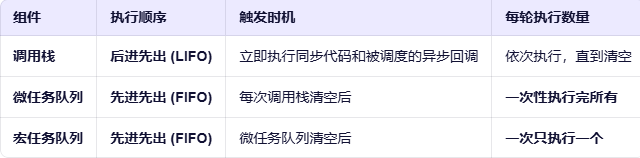

# js中的事件循环机制
## 背景介绍
JavaScript最初是为浏览器设计的脚本语言，其核心特性之一是**单线程**。这意味着在同一时间，JavaScript 只能执行一个任务。
由此引申出一个问题：
如果 JavaScript 是单线程的，那么当遇到一个耗时操作（比如<u>网络请求、文件读取、定时器等待</u>）时，整个程序岂不是会“卡住”？
这很明显是不合理的，因为我们提出了解决方案：**事件循环机制**。
它允许 JavaScript 在等待异步操作完成的同时，继续执行其他代码，从而实现非阻塞行为。

## 内容含义
当 JavaScript 遇到一个需要等待的操作时，它不会停下来干等，而是把这个“等待任务”交给别人（浏览器），自己继续去执行后面的代码。
等到“别人”告诉它“任务完成了”，它再回来处理结果。

将上面的语句用代码表示如下：
```javascript
console.log("开始做饭");

// 设置一个3秒后提醒的“计时器”（异步操作）
setTimeout(() => {
  console.log("牛排煎好了！");
}, 3000); // 3000毫秒 = 3秒

// 关键：JS 不会在这里等3秒！它会立即执行下面的代码
console.log("继续切菜");
console.log("开始炒青菜");
console.log("米饭也好了");

// 输出顺序：
// 开始做饭
// 继续切菜
// 开始炒青菜
// 米饭也好了
// （大约3秒后...）
// 牛排煎好了！
```

## 核心概念
### 调用栈 (Call Stack)
作用：记录当前正在执行的函数调用。
原理：遵循“后进先出”（LIFO）的原则。当一个函数被调用时，它被推入栈顶；当函数执行完毕，它从栈中弹出

### 浏览器 API (Web APIs)
作用：由浏览器提供的一系列非 JavaScript 引擎内置的功能，用于处理异步操作。包含`setTimeout`, `setInterval`, `XMLHttpRequest/fetch`, `DOM 事件（如 click, load）`, `Promise`。

### 任务队列 (Task Queue / Callback Queue)
作用：存放已经完成的异步操作所对应的**回调函数**。
其中任务队列又可以分为**宏任务队列 (Macrotask Queue)**、**微任务队列 (Microtask Queue)**

#### 宏任务队列 (Macrotask Queue)
- 包含 `setTimeout`, `setInterval`, `DOM 事件（如 click, load）` 等。
- 每个宏任务完成后，浏览器会检查微任务队列是否为空。如果为空，才会从宏任务队列中取出下一个任务执行。

#### 微任务队列 (Microtask Queue)
- 包含 `Promise` 的 `then` 回调、`MutationObserver` 等。
- 每个宏任务完成后，浏览器会立即执行微任务队列中的所有任务，而无需等待其他宏任务。

> 根据上面这三个概念，我们可以简单理解为：
**调用栈**是js执行的核心通道，它负责执行同步代码。当碰到异步任务的时候，**调用栈**把异步任务放到**浏览器API**中去执行，等浏览器API执行完毕，再把异步任务对应的回调函数放到**任务队列**中。

我们再用比较形象的比喻一下，调用栈就是我们的人，Web API是我们的助手（贾维斯），任务队列是一个桌子旁边的抽屉，我们人在桌子上办公。
那么就可以理解为：

- 我们人在桌子上办公 —— 调用栈执行任务
- 碰到异步任务，交给贾维斯 —— 异步任务交给浏览器API执行 （贾维斯执行完了任务，把文件放到抽屉中 —— 把异步任务对应的回调函数放到任务队列中）
- 桌面上的文件都执行完了 —— 调用栈清空
- 我们去拿抽屉里面的文件处理 —— 调用栈执行任务队列中的任务

## 事件循环的执行流程🔥
- 执行同步代码：JavaScript 引擎首先执行所有同步代码，并将其函数推入调用栈执行。
- 注册异步任务：当遇到异步操作（如 setTimeout, fetch, Promise）时：
- 相应的 API 被调用，并将任务交给 Web APIs 处理。
- JavaScript 主线程继续执行后续的同步代码，不等待。
- 异步任务完成：当 Web APIs 完成异步操作（例如，定时器时间到、网络请求返回）时，它们会将对应的回调函数放入任务队列中。
- 如果是 setTimeout，回调进入宏任务队列。
- 如果是 Promise.then，回调进入微任务队列。
- 事件循环检查：当调用栈为空时（即所有同步代码和当前正在执行的函数都执行完毕），事件循环开始工作。
- 执行微任务：事件循环首先检查微任务队列。如果队列不为空，它会连续取出并执行所有微任务，直到微任务队列清空。
- 执行宏任务：微任务队列清空后，事件循环从宏任务队列中取出第一个宏任务，将其回调推入调用栈执行。
- 重复：**执行完这个宏任务后，再次检查微任务队列**（因为宏任务的执行可能又产生了新的微任务），清空微任务，然后进入下一个宏任务。这个过程不断重复。

> 根据上面的执行流程我们可以得到

