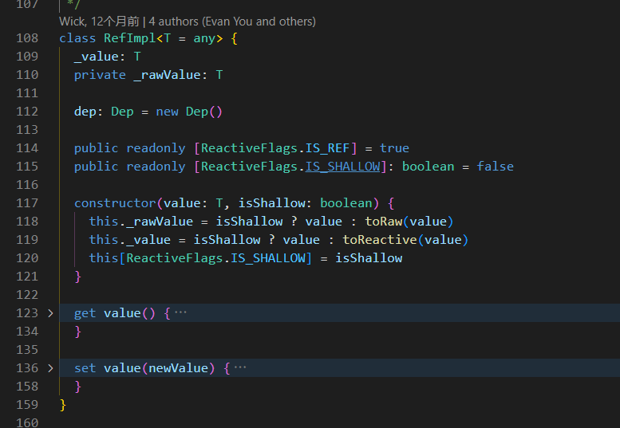

# vue3 Ref解读
跟随本篇文章一起学习vue3源码中关于ref的实现~
首先vue里面关于ref的一些方法有如下几种（目前据我所知）：
```javascript
import { ref, isRef, toRef, shallowRef } from 'vue'
```
## ref入口
[响应式 API：核心——Ref](https://cn.vuejs.org/api/reactivity-core#ref)
`ref()`接受一个内部值，返回一个**响应式的、可更改**的`ref`对象，此对象只有一个指向其内部值的属性`.value`
```javascript
function ref<T>(value: T): Ref<UnwrapRef<T>>

interface Ref<T> {
  value: T
}

export function ref<T>(
  value: T,
): [T] extends [Ref] ? IfAny<T, Ref<T>, T> : Ref<UnwrapRef<T>, UnwrapRef<T> | T>
export function ref<T = any>(): Ref<T | undefined>
export function ref(value?: unknown) {
  return createRef(value, false) // 【核心入口代码】
}

export function shallowRef<T>(
  value: T,
): Ref extends T
  ? T extends Ref
    ? IfAny<T, ShallowRef<T>, T>
    : ShallowRef<T>
  : ShallowRef<T>
export function shallowRef<T = any>(): ShallowRef<T | undefined>
export function shallowRef(value?: unknown) {
  return createRef(value, true) // 【核心入口代码】
}
// 【核心入口代码】
function createRef(rawValue: unknown, shallow: boolean) {
  if (isRef(rawValue)) {
    return rawValue
  }
  return new RefImpl(rawValue, shallow)
}
```
> 这里的核心就是`createRef(value, false)`方法。返回的是一个`RefImpl`实例。其中`shallow`参数控制的就是我们平常用法当中的ref、shallowRef。虽然暂时我还不清楚他们的具体差异。接下去我们就来看看`RefImpl`类的实现。

## RefImpl类

作为一个如此核心的类，居然才区区的50行代码。给我震惊到了，而且构造器也非常的简单。根据我们平常使用的情况来看，可以得到以下猜想：
1. `value`就是我们传入ref的内部值，也是**唯一一个指向其内部值的属性（与文档中呼应）**，例如`ref(0)`中的0。
2. `_rawValue`存储的是原始值，而_value存储的是响应式值（在vue3中就是对应了经过代理的**Proxy对象**）。

借助于AI的分析，我们得到关于RefImpl类的一些代码讲解：
### 构造器
```javascript
constructor(value: T, isShallow: boolean) {
  this._rawValue = isShallow ? value : toRaw(value)
  this._value = isShallow ? value : toReactive(value)
  this[ReactiveFlags.IS_SHALLOW] = isShallow
}
```
`isShallow`表示是否为浅响应。如果为浅响应，则`_value`和`_rawValue`指向同一个值。如果为深响应，则`_value`和`_rawValue`指向不同的值。
> 意思就是：**【浅响应】**不需要对内部值进行响应式处理（也就是**Proxy代理**），而**【深响应】**则需要处理。

这里也可以知道`toRaw`和`toReactive`的作用，`toRaw`的作用是将传入的值**转换为原始值**，而`toReactive`的作用是将传入的值**转换为响应式值**。
`_rawValue`的意思是原始值，`_value`是vue帮我们进行了一层代理，`_rawValue`是**原始值**，也就是我们传入的ref的值。`_rawValue`可以用来比较新旧值是否发生变化。

## toRaw和toReactive
### toRaw
我们接着深入点进去看看`toRaw`和`toReactive`的实现。下面就是`toRaw`的实现。
```javascript
export function toRaw<T>(observed: T): T {
  const raw = observed && (observed as Target)[ReactiveFlags.RAW]
  return raw ? toRaw(raw) : observed
}
...
export enum ReactiveFlags {
  SKIP = '__v_skip',
  IS_REACTIVE = '__v_isReactive',
  IS_READONLY = '__v_isReadonly',
  IS_SHALLOW = '__v_isShallow',
  RAW = '__v_raw',
  IS_REF = '__v_isRef',
}
```
下面我们开始解读一下这段代码，首先**observed**入参表示一个响应式对象（observed：可观察的），然后去尝试访问**__v_raw**属性。在vue中，所有的响应式对象都有一个**__v_raw**属性，这个属性指向的是原始值。
那么如果说observed存在且有**__v_raw**属性，说明observed就是一个响应式对象，那么就可以返回其**__v_raw**属性，也就是原始值。反之说明observed不是一个响应式对象，那么就返回observed本身。
同时这里还存在一个递归调用的逻辑，避免了嵌套的响应式对象。
这个方法还是很好理解的，我们只需要记住一个知识点：<u>vue的响应式对象中，存在一个***__v_raw**属性，这个属性指向的是原始值</u>。
### toReactive
下面我们来看看`toReactive`的实现。
```javascript
// 第一步代码
export const toReactive = <T extends unknown>(value: T): T =>
  isObject(value) ? reactive(value) : value
// 第二步代码
export function reactive(target: object) {
  // if trying to observe a readonly proxy, return the readonly version.
  if (isReadonly(target)) {
    return target
  }
  return createReactiveObject(
    target,
    false,
    mutableHandlers,
    mutableCollectionHandlers,
    reactiveMap,
  )
}
// 第三步代码
function createReactiveObject(
  target: Target,
  isReadonly: boolean,
  baseHandlers: ProxyHandler<any>,
  collectionHandlers: ProxyHandler<any>,
  proxyMap: WeakMap<Target, any>,
) {
  if (!isObject(target)) { // 首先保证传入的参数必须是一个对象，在开发模式下，会有一个警告提示。
    if (__DEV__) {
      warn(
        `value cannot be made ${isReadonly ? 'readonly' : 'reactive'}: ${String(
          target,
        )}`,
      )
    }
    return target
  }
  // 这段代码的目的：如果target已经是一个代理对象，那么直接返回即可
  if (
    target[ReactiveFlags.RAW] &&
    !(isReadonly && target[ReactiveFlags.IS_REACTIVE])
  ) {
    return target
  }
  // 获取代理对象的类型，参考下面
  // enum TargetType {
  //  INVALID = 0, // 表示无法被代理的对象
  //  COMMON = 1, // 表示普通对象
  //  COLLECTION = 2, // 例如集合类型（如 Map、Set 等）
  //}
  const targetType = getTargetType(target)
  if (targetType === TargetType.INVALID) {
    return target
  }
  // 这段代码的目的：如果target已经被代理过，那么直接返回即可
  // proxyMap是一个WeakMap，key是target，value是代理对象
  const existingProxy = proxyMap.get(target)
  if (existingProxy) {
    return existingProxy
  }
  // 当以上条件都不满足，那么就需要创建一个代理对象
  // 关于js中Proxy代理对象的一些基本使用这里不多赘述。vue3中正是使用了Proxy这一工具来实现了响应式
  // Proxy的第一个参数就是你要代理的对象，第二个参数就是代理对象的一些处理函数，比如最常见的get、set...
  const proxy = new Proxy(
    target,
    // 这里把处理函数分为了两种情况，一种是普通对象，一种是集合类型（如 Map、Set 等）
    targetType === TargetType.COLLECTION ? collectionHandlers : baseHandlers,
  )
  proxyMap.set(target, proxy)
  return proxy
}
```
> 这段代码也非常好理解，如果`value`是一个对象，那么就返回一个`响应式对象`，否则就返回`value本身`。同时我们注意到，根据对象target的类型不同，会返回不同的处理函数。
比如：普通对象会返回`baseHandlers`，集合类型会返回`collectionHandlers`。
因此我们继续深入，了解一下`baseHandlers`的实现。

## baseHandlers
```javascript
// 在reactive.ts中可以看到 baseHandlers 对应的是 baseHandlers.ts 文件中的 mutableHandlers
// 代码1
import {
  mutableHandlers, // baseHandlers
  readonlyHandlers,
  shallowReactiveHandlers,
  shallowReadonlyHandlers,
} from './baseHandlers'

// 代码2
// baseHandlers.ts
export const mutableHandlers: ProxyHandler<object> =
  /*@__PURE__*/ new MutableReactiveHandler()

// 代码3【MutableReactiveHandler类的实现】
class MutableReactiveHandler extends BaseReactiveHandler {
  constructor(isShallow = false) {
    super(false, isShallow)
  }

  set(
    target: Record<string | symbol, unknown>,
    key: string | symbol,
    value: unknown,
    receiver: object,
  ): boolean {
    let oldValue = target[key]
    if (!this._isShallow) {
      const isOldValueReadonly = isReadonly(oldValue)
      if (!isShallow(value) && !isReadonly(value)) {
        oldValue = toRaw(oldValue)
        value = toRaw(value)
      }
      if (!isArray(target) && isRef(oldValue) && !isRef(value)) {
        if (isOldValueReadonly) {
          return false
        } else {
          oldValue.value = value
          return true
        }
      }
    } else {
      // in shallow mode, objects are set as-is regardless of reactive or not
    }
    // 检查键是否存在
    // 如果是数组的话，需要检查key是否为整数索引，并且key在数组长度范围内
    // 如果是对象的话，需要检查key是否为对象的属性
    const hadKey =
      isArray(target) && isIntegerKey(key)
        ? Number(key) < target.length
        : hasOwn(target, key)
    const result = Reflect.set(
      target,
      key,
      value,
      isRef(target) ? target : receiver,
    )
    // don't trigger if target is something up in the prototype chain of original
    if (target === toRaw(receiver)) {
      // 这一步是核心所在，如果键存在那么触发更新；如果键不存在那么触发新增
      if (!hadKey) {
        trigger(target, TriggerOpTypes.ADD, key, value)
      } else if (hasChanged(value, oldValue)) {
        trigger(target, TriggerOpTypes.SET, key, value, oldValue)
      }
    }
    // 将Reflect.set的结果返回
    return result
  }

  deleteProperty(
    target: Record<string | symbol, unknown>,
    key: string | symbol,
  ): boolean {
    const hadKey = hasOwn(target, key)
    const oldValue = target[key]
    const result = Reflect.deleteProperty(target, key)
    if (result && hadKey) {
      trigger(target, TriggerOpTypes.DELETE, key, undefined, oldValue)
    }
    return result
  }

  has(target: Record<string | symbol, unknown>, key: string | symbol): boolean {
    const result = Reflect.has(target, key)
    if (!isSymbol(key) || !builtInSymbols.has(key)) {
      track(target, TrackOpTypes.HAS, key)
    }
    return result
  }

  ownKeys(target: Record<string | symbol, unknown>): (string | symbol)[] {
    track(
      target,
      TrackOpTypes.ITERATE,
      isArray(target) ? 'length' : ITERATE_KEY,
    )
    return Reflect.ownKeys(target)
  }
}
```
### set方法
前面我们讲的是`toReactive`，然后接着看到了`baseHandlers`，然后看到了`set`方法。
在Proxy的`set`方法中，我们可以看到`target`是我们传入的对象，`key`是我们传入的键，`value`是我们传入的值，`receiver`是我们传入的代理对象（一共有四个参数）
观察`set`的后半部分代码，我们发现这也许就是响应式功能的实现~如下所示
```javascript
if (target === toRaw(receiver)) {
  // 这一步是核心所在，如果键存在那么触发更新；如果键不存在那么触发新增
  if (!hadKey) {
    // trigger就是触发更新的方法
    // target表示原始对象，TriggerOpTypes表示当前操作的类型，key表示当前操作的键，value表示当前操作的值
    trigger(target, TriggerOpTypes.ADD, key, value) 
  } else if (hasChanged(value, oldValue)) {
    trigger(target, TriggerOpTypes.SET, key, value, oldValue)
  }
}
```

### trigger方法
```javascript
type KeyToDepMap = Map<any, Dep>

export const targetMap: WeakMap<object, KeyToDepMap> = new WeakMap()
/**
 * Finds all deps associated with the target (or a specific property) and
 * triggers the effects stored within.
 *
 * @param target - The reactive object.
 * @param type - Defines the type of the operation that needs to trigger effects.
 * @param key - Can be used to target a specific reactive property in the target object.
 */
export function trigger(
  target: object, // 【参数】原始对象
  type: TriggerOpTypes, // 【参数】当前操作的类型
  key?: unknown, // 【参数】当前操作的键
  newValue?: unknown, // 【参数】当前操作的值
  oldValue?: unknown, // 【参数】当前操作的旧值
  oldTarget?: Map<unknown, unknown> | Set<unknown>,
): void {
  // 根据原始对象从WeakMap中获取对应的depsMap
  const depsMap = targetMap.get(target)
  // 如果depsMap不存在，那么说明当前对象没有被追踪过，直接返回即可
  if (!depsMap) {
    // 这里的globalVersion 是一个全局计数器，每当任何响应式数据发生变化时，它都会递增。它的主要作用是提供一种快速判断机制，帮助 Vue 确定是否有响应式数据发生了变化。
    // 那么此时就会有疑问了，那岂不是每次是否需要重新计算只需要检查自身有关的变量是否发生变化即可，不需要globalVersion来判断
    // 答案当然是否定的，因为globalVersion 提供了一个全局的版本号，用于快速判断是否有任何响应式数据发生变化。这在处理多个计算属性或复杂的响应式系统时非常有用。
    // 如果 Vue 每次都需要逐个检查每个计算属性的所有依赖是否发生变化，性能会显著下降。通过 globalVersion，Vue 可以快速判断是否有任何响应式数据发生变化，从而决定是否需要进一步检查依赖。
    globalVersion++
    return
  }
  // 这里的run函数的作用是触发依赖的更新
  const run = (dep: Dep | undefined) => {
    if (dep) {
      if (__DEV__) {
        dep.trigger({
          target,
          type,
          key,
          newValue,
          oldValue,
          oldTarget,
        })
      } else {
        dep.trigger()
      }
    }
  }
  // 这里的startBatch和endBatch的作用是：
  // 当我们在一个effect中使用多个响应式数据时，我们可以使用startBatch和endBatch来包裹这些响应式数据的操作，这样可以避免多次触发effect的更新。
  startBatch()

  // 如果操作类型是 CLEAR，那么说明当前对象正在被清空，那么就需要遍历depsMap，然后触发所有的依赖项的更新
  if (type === TriggerOpTypes.CLEAR) {
    // collection being cleared
    // trigger all effects for target
    depsMap.forEach(run)
  } else {
    const targetIsArray = isArray(target)
    const isArrayIndex = targetIsArray && isIntegerKey(key)

    if (targetIsArray && key === 'length') {
      const newLength = Number(newValue)
      depsMap.forEach((dep, key) => {
        if (
          key === 'length' ||
          key === ARRAY_ITERATE_KEY ||
          (!isSymbol(key) && key >= newLength)
        ) {
          run(dep)
        }
      })
    } else {
      // schedule runs for SET | ADD | DELETE
      if (key !== void 0 || depsMap.has(void 0)) {
        run(depsMap.get(key))
      }

      // schedule ARRAY_ITERATE for any numeric key change (length is handled above)
      if (isArrayIndex) {
        run(depsMap.get(ARRAY_ITERATE_KEY))
      }

      // also run for iteration key on ADD | DELETE | Map.SET
      switch (type) {
        case TriggerOpTypes.ADD:
          if (!targetIsArray) {
            run(depsMap.get(ITERATE_KEY))
            if (isMap(target)) {
              run(depsMap.get(MAP_KEY_ITERATE_KEY))
            }
          } else if (isArrayIndex) {
            // new index added to array -> length changes
            run(depsMap.get('length'))
          }
          break
        case TriggerOpTypes.DELETE:
          if (!targetIsArray) {
            run(depsMap.get(ITERATE_KEY))
            if (isMap(target)) {
              run(depsMap.get(MAP_KEY_ITERATE_KEY))
            }
          }
          break
        case TriggerOpTypes.SET:
          if (isMap(target)) {
            run(depsMap.get(ITERATE_KEY))
          }
          break
      }
    }
  }
  // 这里的endBatch的作用是：
  // 与startBatch联合使用，避免多次触发更新（等收集完全部的依赖项再统一进行更新）
  endBatch()
}
```