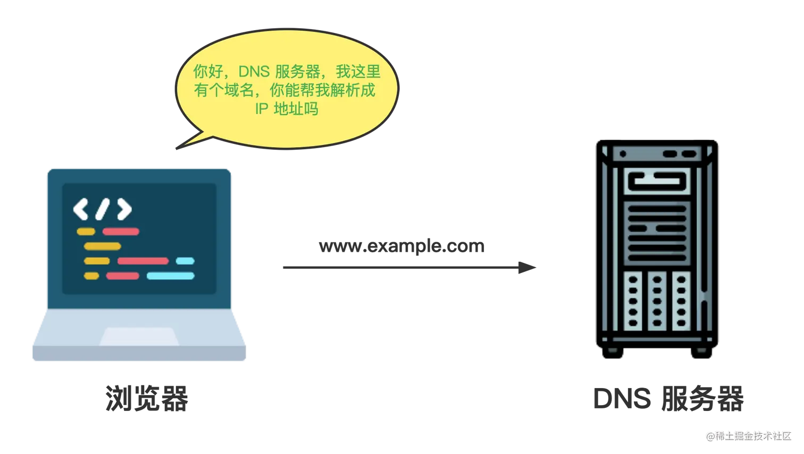
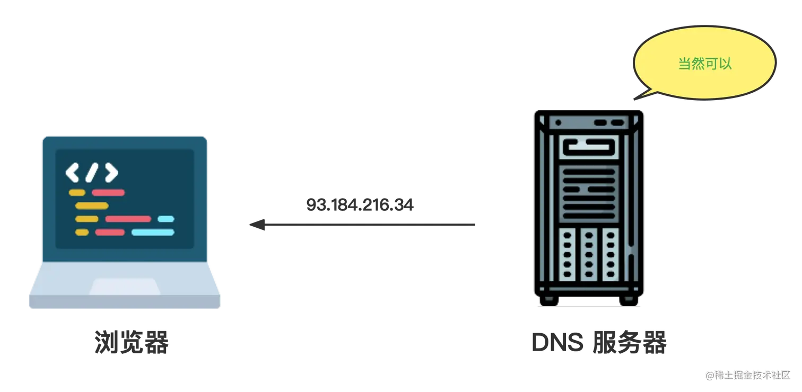

# 浏览器的工作原理

截至目前，用户常用的浏览器主要有：

- windows: Chrome、Edge、火狐Firefox
- macOS：safari

## 导航

浏览器最核心、基本的功能就是访问网页资源。访问网页资源的方式有许多种，包含：

- 点击链接...
- 提交表单...
- 直接在地址栏输入网址：`www.baidu.com`访问
- ...

### 第一步：DNS查询（解析IP地址）

每一个网页由静态资源构成（html、css、js和其他类型的文件）。访问网页的过程就是发送给服务器一个请求，服务器将请求对应的网页的静态资源返回到客户端，客户端获取后进行渲染，看到了我们的页面。

但是，我们所熟知的网址（www.baidu.com等等），对于我们都很明确的知道这对应的是百度搜索引擎的网页，但是对计算机来说，它们**不识别域名**，而是识别IP地址。每一个域名对应着**一个唯一的互联网IP地址**。例如假设百度对应的IP地址为**1.2.3.4**，那么计算机就需要知道这个信息。

这一步就被称为**DNS查询（解析IP地址）**，用下图即可概括：

> DNS服务器告诉你某个域名对应的IP地址后，这个映射关系会被缓存一段时间。当我们下次访问同样的地址（例如www.baidu.com）的时候，就可以避免再重复DNS查询这一步骤，会加快我们的访问速度。
DNS解析记录会被**计算机、浏览器**等存储在设备当中（注册表等等...）。同时，DNS缓存的时间也不是固定的，根据**DNS服务器、操作系统或者浏览器**等各不相同。一般情况下为24小时左右。

### 第二步：TCP握手（三次查询）

在完成第一步DNS解析后，浏览器就知道了目标网页的IP地址。接下去就是准备进行通信，传输数据了。
TCP的三次握手可以概括为：

1. SYN
2. SYN-ACK
3. ACK

