# 浏览器的工作原理

截至目前，用户常用的浏览器主要有：

- **windows**: Chrome、Edge、火狐Firefox
- **macOS**：safari

## 导航

浏览器最核心、基本的功能就是**访问网页资源。访问网页资源的方式有许多种，包含：

- 点击链接...
- 提交表单...
- 直接在地址栏输入网址：`www.baidu.com`访问
- ...

### 第一步：DNS查询（解析IP地址）

每一个网页由静态资源构成（html、css、js和其他类型的文件）。访问网页的过程就是发送给服务器一个请求，服务器将请求对应的网页的静态资源返回到客户端，客户端获取后进行渲染，看到了我们的页面。

但是，我们所熟知的网址（www.baidu.com等等），对于我们都很明确的知道这对应的是百度搜索引擎的网页，但是对计算机来说，它们**不识别域名**，而是识别IP地址。每一个域名对应着**一个唯一的互联网IP地址**。例如假设百度对应的IP地址为**1.2.3.4**，那么计算机就需要知道这个信息。

这一步就被称为**DNS查询（解析IP地址）**，用下图即可概括：


> DNS服务器告诉你某个域名对应的IP地址后，这个映射关系会被缓存一段时间。当我们下次访问同样的地址（例如www.baidu.com）的时候，就可以避免再重复DNS查询这一步骤，会加快我们的访问速度。
DNS解析记录会被**计算机、浏览器**等存储在设备当中（注册表等等...）。同时，DNS缓存的时间也不是固定的，根据**DNS服务器、操作系统或者浏览器**等各不相同。一般情况下为24小时左右。

### 第二步：TCP握手（三次查询）

在完成第一步DNS解析后，浏览器就知道了目标网页的IP地址。接下去就是准备进行通信，传输数据了。
TCP的三次握手可以概括为：

1. SYN
2. SYN-ACK
3. ACK


> **第一次握手：**
发送的**数据包（SYN包）**中的SYN位为1，表示第一次握手的状态。同时携带一个序列号*seq=x*，x是一个随机产生的数值。发送之后此时客户端会进入**SYN_SEND**的状态。等待着服务器的响应
**第二次握手：**
**服务端发送SYN+ACK包**。这个数据包中包含什么数据呢？服务器的一个序列号*seq=y*，同时对客户端的序列号进行了确认（返回*ack=x+1*）。这里的*+1*还表示服务端期望收到的下一个数据包的seq序列号。返回响应后，服务端进入SYN_REVE状态。
**第三次握手：**
客户端接收到服务端发送的SYN+ACK包后，会再次**向服务端发送一个ACK包**，作为一次**最终确认**。这个ack包的序列号即为第二步的*ack=x+1*。此时，客户端进入ESTABLISHED状态，TCP连接建立完成。

上面详细的介绍了三次握手中的数据包含义，序列号等信息，便于我们更加好理解这三次握手对应的的代号（SYN、SYN-ACK、ACK）

### 第三步：TLS协商（Https）

对于通过 HTTPS 建立的安全连接，需要进行另一次握手。**这种握手（TLS协商）**决定了哪个密码将被用于加密通信，验证服务器，并在开始实际的数据传输之前建立一个安全的连接。

> 通过Https建立的链接相对安全性更高，因此需要进行另一次的握手。

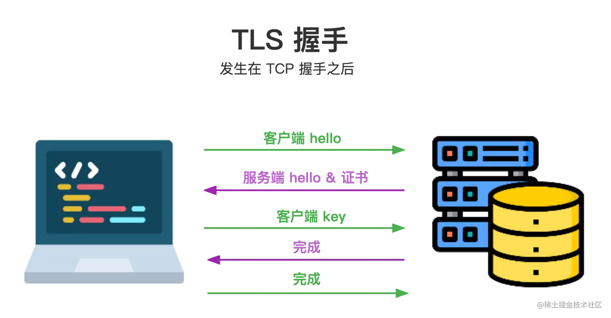

在这一步骤中，客户端和服务端之间还交换了一些信息，其过程大致如下：

1. **客户端`hello`**：客户端向服务端发送一条消息，包括TLS版本和支持的密码套件（一串数组），以及一串随机字节称为**客户端随机数**。——总共发送三部分信息。
2. **服务端heelo、证书**：服务端返回一条信息，其中包括服务端的TLS证书版本、服务端选择的密码套件和**服务端随机数**。
3. **服务端发送自己的证书**：为了让客户端验证自己的身份，服务端还把自己的证书给发送了过去，证书包含了服务端的公钥。
4. **客户端验证服务器证书**：客户端验证服务端发来的证书（校验证书是否过期、是否有效...），验证通过后回根据服务端的公钥等秘钥生成一个*预主秘钥*。接着把这个*预主秘钥*发送回服务端。
5. 至此为止，客户端服务端均通过信息交换获取到了**客户端随机数**、**服务端随机数**以及**预主秘钥**。根据这三个信息来生成最终的**会话秘钥**。
6. 客户端此时会发送一个消息（Change Cipher Spec）、Finished消息通知服务端：后续我们之间的通信将采用**确定好的密码套件**、**会话秘钥**来进行加密通信。同时验证双方的加密，解密功能都正常OK。TLS握手正式结束。

紧接着双方就可以收发加密的https的请求和响应了。

## 获取数据

### HTTP 请求

在我们建立好TCP握手（或者TLS协商之后），我们就可以准备开始进行通信了。
首先，客户端会发送一个**HTTP GET**请求，请求页面的HTML文件。这一步使用的是**HTTP协议**。

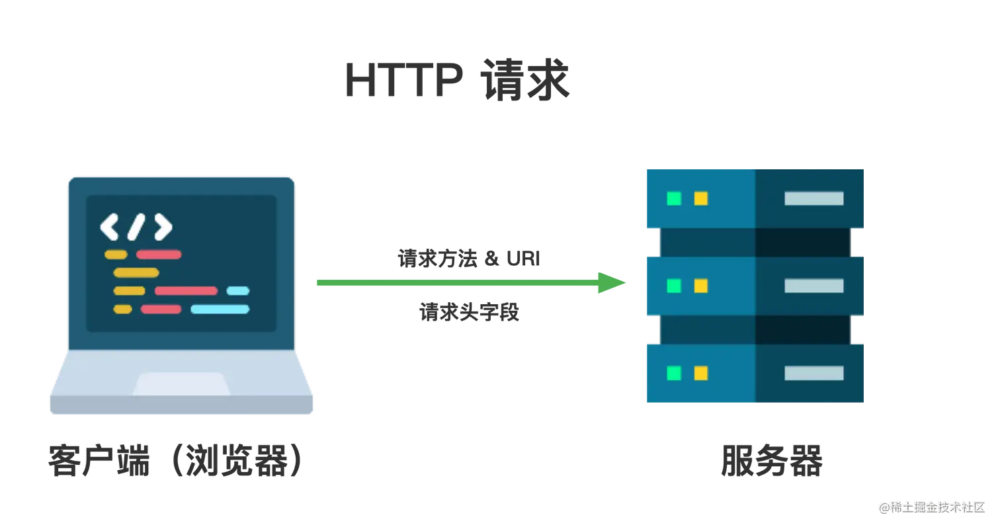

统一资源标识符（uniform resource identifier）的缩写是URI，用于识别互联网上的抽象或物理资源（例如网站或电子邮件等资源地址），也就是代表了HTTP 请求的目标。
一个URI通常是由以下几部分组成的：
某些情况下，也会被称为统一资源定位符（Uniform Resource Locator‌）：URL

1. 协议：访问资源所使用的协议，如`http`或`https`
2. 域名：标识服务器所在的地址（也就是IP地址）
3. 端口号：标识服务器上的端口号。默认情况下，HTTP使用80端口、HTTPS使用443端口
4. 路径：指定资源在服务器上的具体路径。
5. 查询参数：键值对的形式拼接在路径的后面，以?开始，通常用于GET请求。
6. 片段标识符：用于指定资源中的某个片段，不会被发送到服务器，例如#fragment

HTTP 请求头

是客户端发送给服务端的请求中的头部字段，包含了一些请求相关的信息。

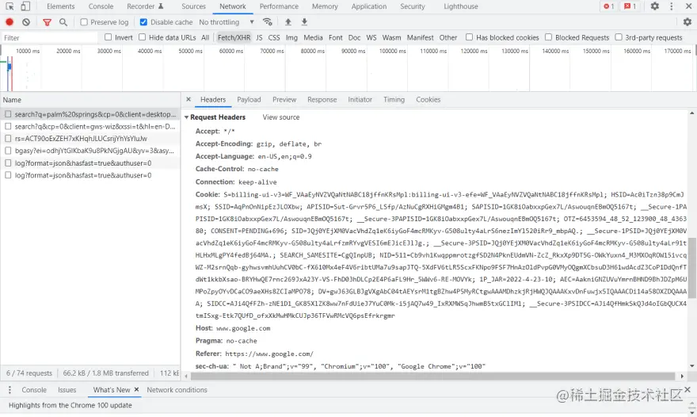

### HTTP 响应

一旦服务端接收到客户端发来的HTTP 请求的时候，服务端会对其进行处理并返回一个HTTP 响应。
其中包含了<u>响应头信息</u>、和<u>响应本身的内容</u>。

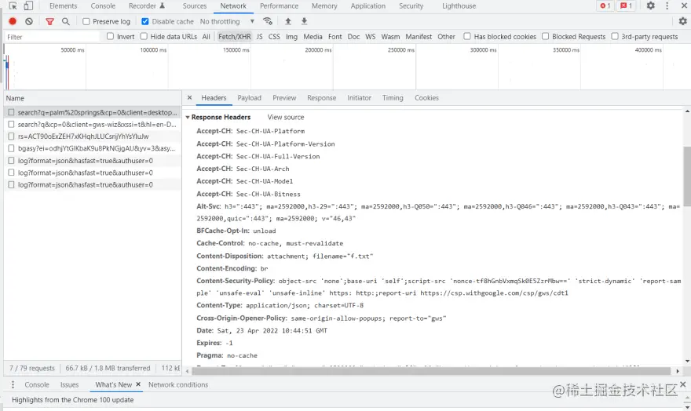

状态码：代表HTTP响应的状态值，一般有**200、400、500**等。其中200表示请求是成功的。‘

一般初始请求的响应，只有HTML被请求并从服务端当中接收到客户端。这个初始请求的响应包含收到的第一个字节的数据。第一个字节的数据（TTFB）是指用户从提出请求（在地址栏输入网站地址访问） 到 收到第一个HTML数据包的时间。

### TCP慢启动和拥塞算法

## HTML解析

HTML的解析是指将程序分析并转换为运行时环境可以执行的内部格式。
这一步由**浏览器引擎**去完成，它是每个浏览器的核心组件（注意这里不是js V8 引擎）。
目前常用的浏览器引擎有以下几种：

1. **Blink**
由Google开发，基于Webkit引擎，具有高性能和快速渲染的特点，广泛应用于众多浏览器中。
例如：Chrome、Edge、国内主流的一些浏览器等等

2. **WebKit**
由KDE项目开发，是一个开源的浏览器引擎，广泛应用于苹果的Safari浏览器，具有良好的标准支持和跨平台特性。
例如：Safari

3. **Gecko**
由Mozilla基金会开发，也是一个开源的渲染引擎，具有良好的跨平台支持和对网页标准的高兼容性。
例如：FireFox

解析过程可以分为 **加载与初始化**、**词法分析** 和 **构造树（DOM树）** 这些步骤

### 1.加载与初始化

浏览器通过HTTP请求获取到HTML文档，开始逐行读取内容。现代浏览器都采用**流式解析（即为边下载边解析）**，而并不是等待整个文档下载完成。注意这里接收到的HTML数据属于**字节流数据**。

例如假设浏览器初始接收到的第一个HTML文档如下所示：
```html
<html>
  <body>
    <div>1</div>
    <div>test</div>
  </body>
</html>
```

### 2.词法分析（标记化Token）——工具：分词器
将HTML代码分解成一个个有具体意义的标记，如标签名（包含开始标签、结束标签）、属性名、属性值，文本内容等。例如对于`<a href="https://example.com">Example</a>`，词法分析会将其分解为
- a：标签名
- href：属性名
- https://example.com：属性值
- Example：文本内容

词法分析这一步骤相当于就是逐行读取，并把HTML内容分解成一系列的Token。这其实相当于<u>你把一篇英文文章拆解为一个个的英语单词</u>，并标记其含义。

### 3.语法分析（构造DOM树）
在第二步的词法分析中，会将分解得到的Token按顺序、结构压入一个**Token栈**。这个栈用于构造DOM树，具体的流程就是**压入Token栈——弹出Token并生成节点——塞入DOM树**。

以上面的HTML片段为例，经过第二步词法分析后得到的一连串Token（注意**这不是Token栈**）如下：

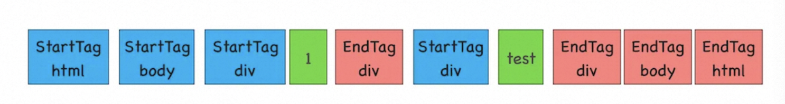

> 补充说明一下，在HTML解析器开始工作的时候，它会自动创建一个doucument结构，同时
创建一个表示document StartTag的Token放入上面的Token栈。

也就是说，初始状态不是全空的，而是如下所示：

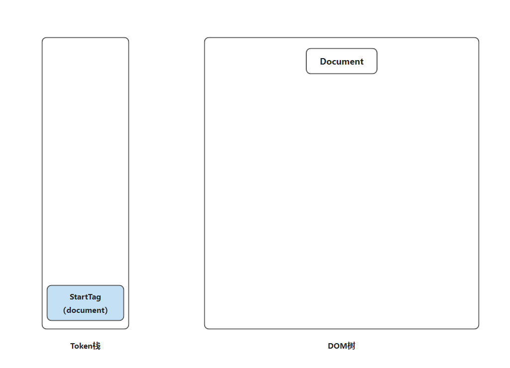

根据上面的**这串Token栈**，我们详细解读一下DOM树的构建过程。这里会有一个规则清单：

- **规则1**：如果压入到栈中的是StartTag（开始标签），HTML解析器就为这个Token创建一个DOM节点，然后将这个节点插入到DOM树中。具体插入到哪个位置呢？这个节点的父节点就是在栈中相邻的那个Token对应的节点。
- **规则2**：如果分词器解析出来是文本 Token，那么会生成一个文本节点，然后将该节点加入到 DOM 树中，**文本 Token 是不需要压入到栈中**，它的父节点就是当前栈顶 Token 所对应的 DOM 节点。
- **规则3**：如果分词器解析出来的是 EndTag 标签，比如是 EndTag div，HTML 解析器会查看 Token 栈顶的元素是否是 StarTag div，如果是，就**将 StartTag div 从栈中弹出**，表示该 div 元素解析完成。

1. 首先第一位是StartTag（html），属于<u>开始标签</u>，我们直接放入Token栈。符合规则1，执行相应的操作（见上）。创建一个HTML节点，并插入到Document中。得到：

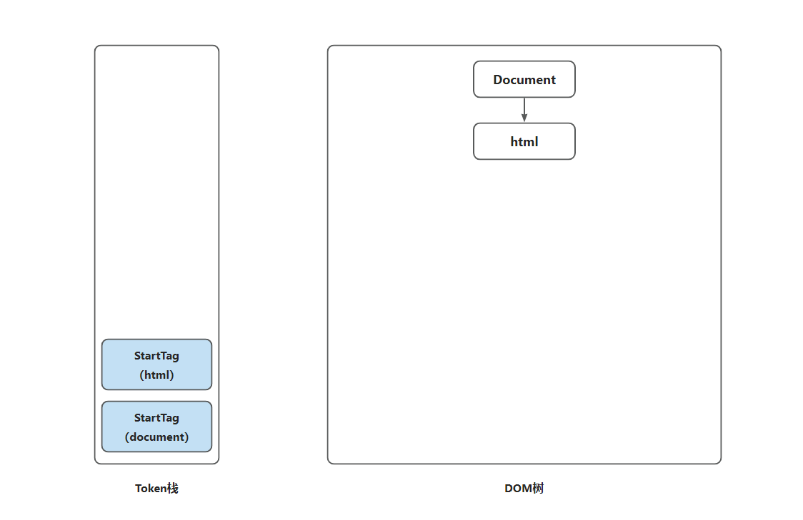

2. 接着第二位是StartTag（body），也属于<u>开始标签</u>，和上一步一样。不多赘述了。

3. 第三位是StartTag（div），也属于<u>开始标签</u>，和上一步一样。不多赘述了。到此为止，我们会得到：

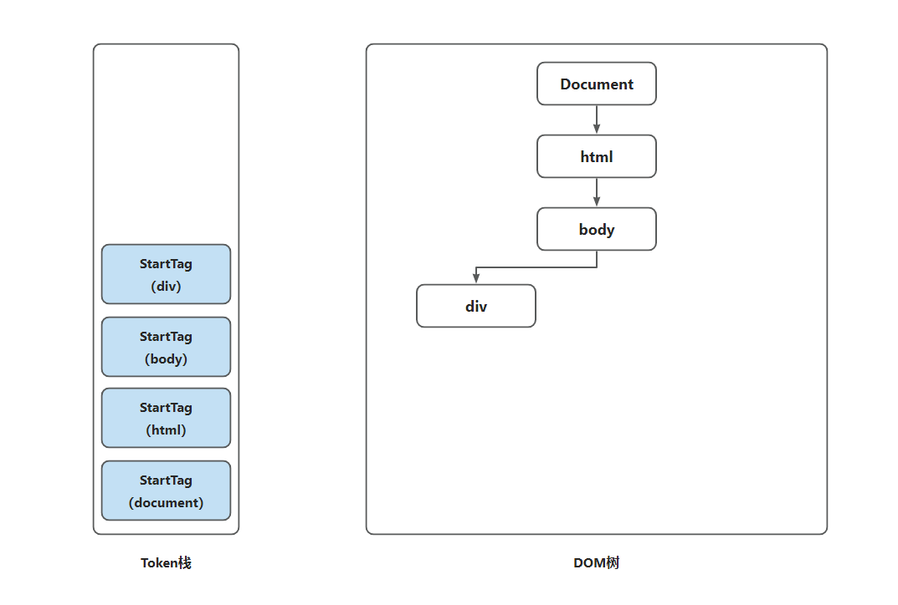

4. 到了第四位，有一些特殊。是一个文本：1。此时我们执行规则2，会得到：

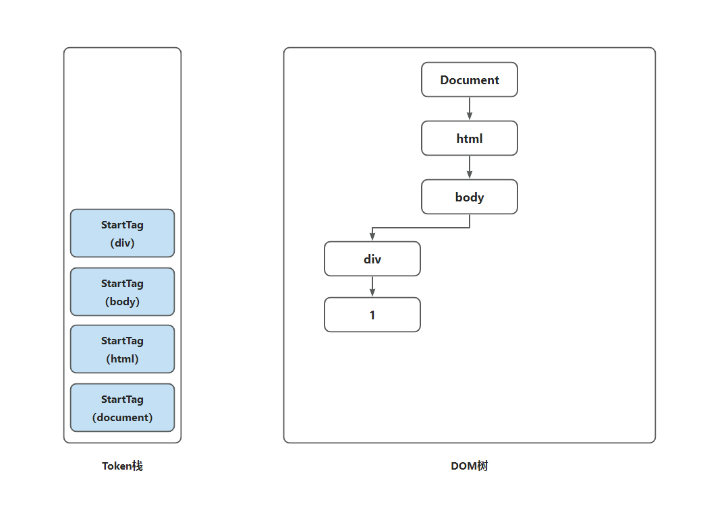

5. 到了第五位，我们会解析到第一个EndTag（div）。此时我们执行规则3，会得到：

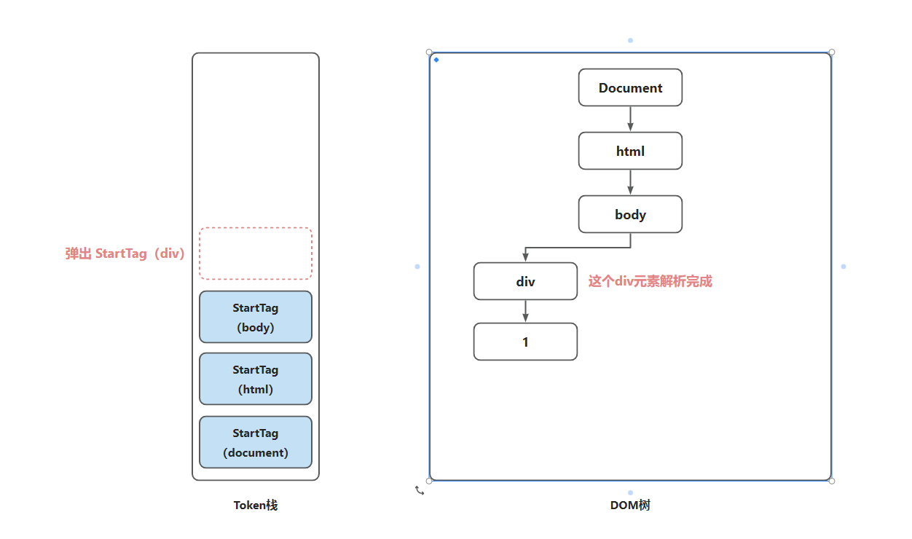

6. 如此往复直到遍历完成所有的Token，最终我们会得到如下图所示。此时DOM树已经完整生成。

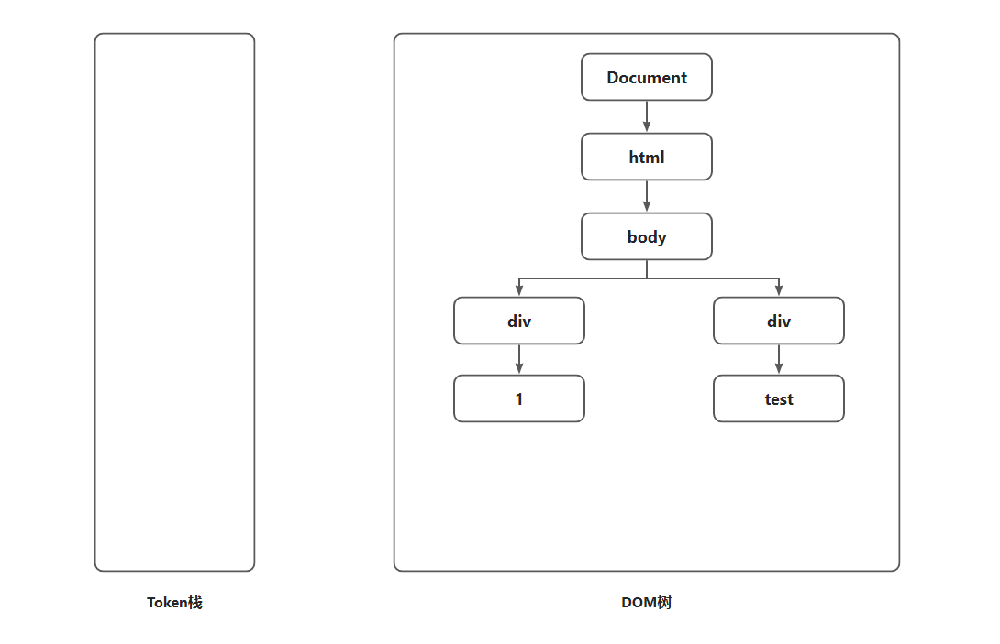

> 上面演示的仅仅是一个最简单、最基础的HTML结构生成DOM树的过程。实际应用中，除了最基本的HTML结构还包含CSS和Javascript，又包含其它一些媒体文件（图片、视频、音频等等），所以处理过程会远比上面演示的更复杂。我们首先要理解上面演示的这个最基本的原理即可。

那么问题来了，当我们碰到一些复杂的HTML结构，其执行过程是怎么样的呢？
这就是**外部资源处理与阻塞机制**

#### 外部资源处理与阻塞机制

```html
<html>
  <body>
    <div>1</div>
    <script>
      let div1 = document.getElementsByTagName('div')[0]
      div1.innerText = 'time.geekbang'
    </script>
    <div>test</div>
  </body>
</html>
```

比如上面这段代码，前面的过程都一样。但是当解析到`script`标签的时候，HTML解析器判断这是一段可执行脚本，此时就会暂停DOM的解析构建过程。因为脚本中可能会对DOM结构进行修改。<u>js是单线程语言</u>。

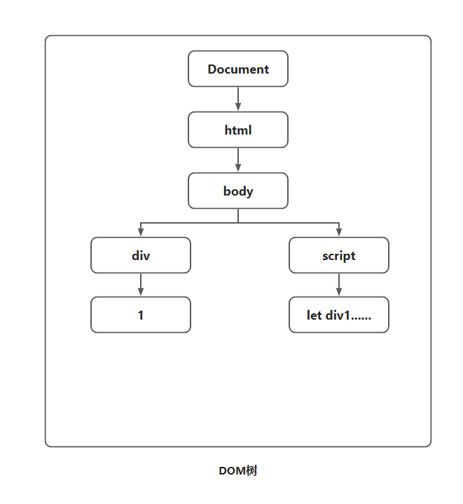

此时，<u>HTML解析器暂停工作，Javascript引擎介入工作</u>，并**执行script标签中的这段脚本代码**。
这段脚本代码修改了第一个div标签中的内容（从原本的1改为了'time.geekbang'），那么此时DOM树结构为：

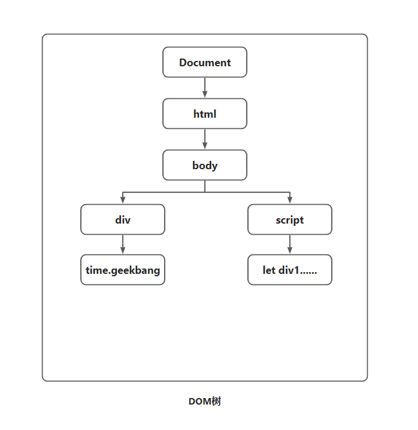