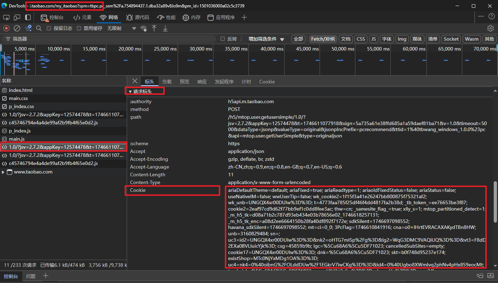

# 详解Cookie存储
## 背景
当我们首次登录某个网站（比如淘宝网）成功的时候，当我们下次直接打开淘宝网，就不需要再次登录了。一般这个时间可以维持在**3-5天甚至更长**。
这其中实现的技术就是通过`cookie`。

## 使用场景
cookie相比于localStorage等存储方式的最大区别，就是cookie它的存储容量非常有限，一般只有**4kb**左右。
所以自然而然的，cookie只适合存储一些<u>比较小的数据</u>，例如<u>用户的登录信息</u>等。

## 工作原理
一般情况下，我们的cookie是通过服务端来存储的。这一过程具体是怎么实现的呢？我们用登录淘宝网来举例：

当我们首次打开网站，输入账号密码进行登录，服务端会校验你的账户信息，校验通过后确认登录，浏览器再打开到首页进行浏览。
在这个过程中，服务端会通过<u>set-cookie</u>来设置cookie，然后将cookie通过响应头返回给浏览器。
浏览器拿到**HTTP响应头**后，会将cookie存储到浏览器中（请注意，这一步是**浏览器自动完成的，因此我们感知不到**），如下图：


我们可以看到，在响应头中，服务端给我们设置了很多的`Set-Cookie`。

然后在下次请求的时候，会将cookie通过<u>cookie</u>**HTTP请求头**再次发送给服务端（请注意，这一步也是**浏览器自动完成的，因此我们感知不到**），如下图：



综上所述，通过cookie，服务端可以直接获取到一些浏览器（也就是客户端）的一些信息，从而实现一些功能，比如上面说到的**淘宝的自动登录**。

## js操作cookie
### 1️⃣读取 cookie
```javascript
const cookies = document.cookie; // 获取所有 Cookie，返回一个字符串
console.log(cookies); // 输出：user_id=12345
```


⚙️解析cookie字符串转换为Object对象的函数：
```javascript
function parseCookies(cookieString) {
  // 创建一个空对象来存储解析后的 Cookie
  const cookies = {};

  // 如果 cookieString 是空字符串，直接返回空对象
  if (!cookieString) {
    return cookies;
  }

  // 使用分号分割字符串，得到每个 key=value 形式的 Cookie
  const cookieArray = cookieString.split('; ');

  // 遍历每个 Cookie
  cookieArray.forEach((cookie) => {
    // 使用等号分割 key 和 value
    const [key, value] = cookie.split('=');
    // 将 key 和 value 添加到对象中
    cookies[key] = value;
  });

  return cookies;
}
```
### 2️⃣设置/修改 cookie
cookie的键名是唯一的，因此如果设置了一个已存在的键名，那么新的值将会覆盖旧的值。
```javascript
// 设置一个简单的 Cookie
// 这里注意，document.cookie并不会直接将原来的所有cookie全部覆盖，而是会将新的cookie追加到原来的cookie后面
document.cookie = "user_id=12345; expires=Thu, 18 Dec 2025 12:00:00 GMT; path=/"; 

// 设置一个带有 HttpOnly 和 Secure 属性的 Cookie
// 如果这个cookie带有HttpOnly属性，那么这个cookie只能在HTTP请求头中被访问，不能在JavaScript中被访问，也就是说无法通过document.cookie来获取这个cookie的值（比如下面的auth_token）
document.cookie = "auth_token=xyz789; expires=Thu, 18 Dec 2025 12:00:00 GMT; path=/; secure; httponly";
```
### 3️⃣删除 cookie
删除一个 Cookie 的方法是将其过期时间设置为**过去的时间**，这样浏览器会自动删除该Cookie。
```javascript
document.cookie = "user_id=; expires=Thu, 01 Jan 1970 00:00:00 GMT; path=/";
```
📌请注意，当你满足<u>修改或者删除的条件</u>的时候，并不就意味着你可以操作成功。在修改或者删除的时候，必须满足`Path属性`还有`Domain属性`都要相同。

> 例如，如果设置时使用了`path=/admin`，那么修改或删除时也必须使用`path=/admin`。

## cookie的属性

```javascript
document.cookie = "[cookie相关内容]";

user_id=12345 // 键名和键值，键名和键值之间使用等号连接——这是最关键的键值对
Domain=example.com // 指定该 Cookie 只能在 example.com 及其子域名下使用
Path=/ // 指定该 Cookie 可以被访问的路径是网站的根路径，即整个网站都可以访问
Expires=Wed, 21 Oct 2025 07:28:00 GMT // 指定该 Cookie 的过期时间为 2025 年 10 月 21 日上午 7:28:00
Max-Age=3600 （单位是s）// 指定该 Cookie 的最大有效时间为 3600 秒（即 1 小时）
Secure // 指定该 Cookie 只能在 HTTPS 连接中使用
HttpOnly // 指定该 Cookie 只能在 HTTP 请求头中被访问，不能在 JavaScript 中被访问
SameSite=Strict
Priority=High // 指定该 Cookie 的优先级为高
Version=1 // 指定该 Cookie 的版本号为 1
Comment=This cookie stores the user ID // 指定该 Cookie 的注释信息，用于描述该 Cookie 的用途
CommentURL=https://example.com/cookie-info.html  // 指定该 Cookie 的注释信息的 URL，用于提供更多关于该 Cookie 的信息
Discard // 指定该 Cookie 应该被丢弃，而不是存储在浏览器中（如果设置了过期时间Expires或者最大有效时间Max-Age，那么一般就不需要设置Discard）
```