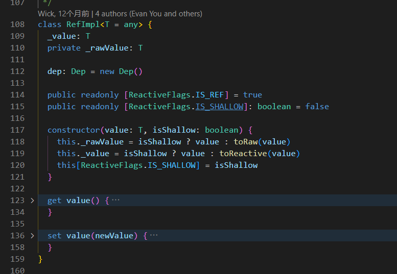

# vue3 Ref解读
跟随本篇文章一起学习vue3源码中关于ref的实现~
首先vue里面关于ref的一些方法有如下几种（目前据我所知）：
```javascript
import { ref, isRef, toRef, shallowRef } from 'vue'
```
## ref入口
[响应式 API：核心——Ref](https://cn.vuejs.org/api/reactivity-core#ref)
`ref()`接受一个内部值，返回一个**响应式的、可更改**的`ref`对象，此对象只有一个指向其内部值的属性`.value`
```javascript
function ref<T>(value: T): Ref<UnwrapRef<T>>

interface Ref<T> {
  value: T
}

export function ref<T>(
  value: T,
): [T] extends [Ref] ? IfAny<T, Ref<T>, T> : Ref<UnwrapRef<T>, UnwrapRef<T> | T>
export function ref<T = any>(): Ref<T | undefined>
export function ref(value?: unknown) {
  return createRef(value, false) // 【核心入口代码】
}

export function shallowRef<T>(
  value: T,
): Ref extends T
  ? T extends Ref
    ? IfAny<T, ShallowRef<T>, T>
    : ShallowRef<T>
  : ShallowRef<T>
export function shallowRef<T = any>(): ShallowRef<T | undefined>
export function shallowRef(value?: unknown) {
  return createRef(value, true) // 【核心入口代码】
}
// 【核心入口代码】
function createRef(rawValue: unknown, shallow: boolean) {
  if (isRef(rawValue)) {
    return rawValue
  }
  return new RefImpl(rawValue, shallow)
}
```
> 这里的核心就是`createRef(value, false)`方法。返回的是一个`RefImpl`实例。其中`shallow`参数控制的就是我们平常用法当中的ref、shallowRef。虽然暂时我还不清楚他们的具体差异。接下去我们就来看看`RefImpl`类的实现。

## RefImpl类

作为一个如此核心的类，居然才区区的50行代码。给我震惊到了，而且构造器也非常的简单。根据我们平常使用的情况来看，可以得到以下猜想：
1. `value`就是我们传入ref的内部值，也是**唯一一个指向其内部值的属性（与文档中呼应）**，例如`ref(0)`中的0。
2. `_rawValue`存储的是原始值，而_value存储的是响应式值（在vue3中就是对应了经过代理的**Proxy对象**）。

借助于AI的分析，我们得到关于RefImpl类的一些代码讲解：
### 构造器
```javascript
constructor(value: T, isShallow: boolean) {
  this._rawValue = isShallow ? value : toRaw(value)
  this._value = isShallow ? value : toReactive(value)
  this[ReactiveFlags.IS_SHALLOW] = isShallow
}
```
`isShallow`表示是否为浅响应。如果为浅响应，则`_value`和`_rawValue`指向同一个值。如果为深响应，则`_value`和`_rawValue`指向不同的值。
> 意思就是：**【浅响应】**不需要对内部值进行响应式处理（也就是**Proxy代理**），而**【深响应】**则需要处理。

这里也可以知道`toRaw`和`toReactive`的作用，`toRaw`的作用是将传入的值**转换为原始值**，而`toReactive`的作用是将传入的值**转换为响应式值**。
`_rawValue`的意思是原始值，`_value`是vue帮我们进行了一层代理，`_rawValue`是**原始值**，也就是我们传入的ref的值。`_rawValue`可以用来比较新旧值是否发生变化。

## toRaw和toReactive
### toRaw
我们接着深入点进去看看`toRaw`和`toReactive`的实现。下面就是`toRaw`的实现。
```javascript
export function toRaw<T>(observed: T): T {
  const raw = observed && (observed as Target)[ReactiveFlags.RAW]
  return raw ? toRaw(raw) : observed
}
...
export enum ReactiveFlags {
  SKIP = '__v_skip',
  IS_REACTIVE = '__v_isReactive',
  IS_READONLY = '__v_isReadonly',
  IS_SHALLOW = '__v_isShallow',
  RAW = '__v_raw',
  IS_REF = '__v_isRef',
}
```
下面我们开始解读一下这段代码，首先**observed**入参表示一个响应式对象（observed：可观察的），然后去尝试访问**__v_raw**属性。在vue中，所有的响应式对象都有一个**__v_raw**属性，这个属性指向的是原始值。
那么如果说observed存在且有**__v_raw**属性，说明observed就是一个响应式对象，那么就可以返回其**__v_raw**属性，也就是原始值。反之说明observed不是一个响应式对象，那么就返回observed本身。
同时这里还存在一个递归调用的逻辑，避免了嵌套的响应式对象。
这个方法还是很好理解的，我们只需要记住一个知识点：<u>vue的响应式对象中，存在一个***__v_raw**属性，这个属性指向的是原始值</u>。
### toReactive
下面我们来看看`toReactive`的实现。
```javascript
// 第一步代码
export const toReactive = <T extends unknown>(value: T): T =>
  isObject(value) ? reactive(value) : value
// 第二步代码
export function reactive(target: object) {
  // if trying to observe a readonly proxy, return the readonly version.
  if (isReadonly(target)) {
    return target
  }
  return createReactiveObject(
    target,
    false,
    mutableHandlers,
    mutableCollectionHandlers,
    reactiveMap,
  )
}
// 第三步代码
function createReactiveObject(
  target: Target,
  isReadonly: boolean,
  baseHandlers: ProxyHandler<any>,
  collectionHandlers: ProxyHandler<any>,
  proxyMap: WeakMap<Target, any>,
) {
  if (!isObject(target)) { // 首先保证传入的参数必须是一个对象，在开发模式下，会有一个警告提示。
    if (__DEV__) {
      warn(
        `value cannot be made ${isReadonly ? 'readonly' : 'reactive'}: ${String(
          target,
        )}`,
      )
    }
    return target
  }
  // 这段代码的目的：如果target已经是一个代理对象，那么直接返回即可
  if (
    target[ReactiveFlags.RAW] &&
    !(isReadonly && target[ReactiveFlags.IS_REACTIVE])
  ) {
    return target
  }
  // 获取代理对象的类型，参考下面
  // enum TargetType {
  //  INVALID = 0, // 表示无法被代理的对象
  //  COMMON = 1, // 表示普通对象
  //  COLLECTION = 2, // 例如集合类型（如 Map、Set 等）
  //}
  const targetType = getTargetType(target)
  if (targetType === TargetType.INVALID) {
    return target
  }
  // 这段代码的目的：如果target已经被代理过，那么直接返回即可
  // proxyMap是一个WeakMap，key是target，value是代理对象
  const existingProxy = proxyMap.get(target)
  if (existingProxy) {
    return existingProxy
  }
  // 当以上条件都不满足，那么就需要创建一个代理对象
  // 关于js中Proxy代理对象的一些基本使用这里不多赘述。vue3中正是使用了Proxy这一工具来实现了响应式
  // Proxy的第一个参数就是你要代理的对象，第二个参数就是代理对象的一些处理函数，比如最常见的get、set...
  const proxy = new Proxy(
    target,
    // 这里把处理函数分为了两种情况，一种是普通对象，一种是集合类型（如 Map、Set 等）
    targetType === TargetType.COLLECTION ? collectionHandlers : baseHandlers,
  )
  proxyMap.set(target, proxy)
  return proxy
}
```
> 这段代码也非常好理解，如果`value`是一个对象，那么就返回一个`响应式对象`，否则就返回`value本身`。

### baseHandlers
让我们先接着钻入代码，了解一下`baseHandlers`的实现
```javascript
// 在reactive.ts中可以看到 baseHandlers 对应的是 baseHandlers.ts 文件中的 shallowReadonlyHandlers
// 代码1
import {
  mutableHandlers,
  readonlyHandlers,
  shallowReactiveHandlers,
  shallowReadonlyHandlers,
} from './baseHandlers'

// 代码2
// baseHandlers.ts
export const shallowReadonlyHandlers: ReadonlyReactiveHandler =
  /*@__PURE__*/ new ReadonlyReactiveHandler(true)

// 代码3
class ReadonlyReactiveHandler extends BaseReactiveHandler {
  constructor(isShallow = false) {
    super(true, isShallow)
  }

  set(target: object, key: string | symbol) {
    if (__DEV__) {
      warn(
        `Set operation on key "${String(key)}" failed: target is readonly.`,
        target,
      )
    }
    return true
  }

  deleteProperty(target: object, key: string | symbol) {
    if (__DEV__) {
      warn(
        `Delete operation on key "${String(key)}" failed: target is readonly.`,
        target,
      )
    }
    return true
  }
}
```
> 仔细一看发现，`baseHandlers`其实就是一个`ReadonlyReactiveHandler`实例。`ReadonlyReactiveHandler`的实现也比较简单，仅仅是禁用了`deleteProperty`和`set`方法。那么重点应该就是在`BaseReactiveHandler`类中了。