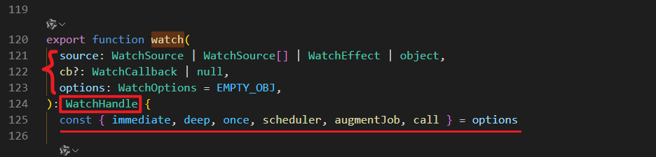

# vue3 数据监听
## watch
[侦听器](https://cn.vuejs.org/guide/essentials/watchers.html)
`watch`应该是我们使用频率很高的一个函数了，它的作用是：
在`组合式API`中，我们可以使用`watch`函数在<u>每次响应式状态发生变化时触发回调函数</u>，使用示例如下：
```javascript
const count = ref(0)

watch(count, (newCount, oldCount) => {
  console.log(`count is: ${newCount}`)
  console.log(`oldCount was: ${oldCount}`)
}, {})
```
watch函数接受三个参数，分别是`数据源source`、`回调函数callback`和`配置选项options`。
同时，watch返回一个`停止函数stop`，用于停止监听。
如下图所示：



接下去我们逐行解读一下watch函数内部的逻辑实现：
```javascript
// 解构参数
const { immediate, deep, once, scheduler, augmentJob, call } = options

// 当传入的source为非法值时，抛出告警函数，这个函数仅会在开发环境下执行
const warnInvalidSource = (s: unknown) => {
  ;(options.onWarn || warn)(
    `Invalid watch source: `,
    s,
    `A watch source can only be a getter/effect function, a ref, ` +
      `a reactive object, or an array of these types.`,
  )
}

const reactiveGetter = (source: object) => {
  // traverse will happen in wrapped getter below
  if (deep) return source
  // for `deep: false | 0` or shallow reactive, only traverse root-level properties
  if (isShallow(source) || deep === false || deep === 0)
    return traverse(source, 1)
  // for `deep: undefined` on a reactive object, deeply traverse all properties
  return traverse(source)
}
```

### 数据源source

通过上面可以看到，数据源source的类型有以下几种：`WatchSource | WatchSource[] | WatchEffect | object`

```javascript
// WatchSource表示Ref、ComputedRef或箭头函数的类型
export type WatchSource<T = any> = Ref<T, any> | ComputedRef<T> | (() => T)

// 在源码中的开头也有对source的一段校验
// 监听数据源只能是getter或者带有副作用的函数、ref类型、响应式对象或者以上构成的数组
const warnInvalidSource = (s: unknown) => {
  ;(options.onWarn || warn)(
    `Invalid watch source: `,
    s,
    `A watch source can only be a getter/effect function, a ref, ` +
      `a reactive object, or an array of these types.`,
  )
}
```

### 回调函数callback

### 配置选项options
比较常用的配置项有：
- `immediate`：是否立即执行回调函数，默认为false。
- `deep`：是否深度监听，默认为false。
- `once`：是否仅需单次执行。

### 深度遍历函数traverse

```javascript
export function traverse(
  value: unknown,
  depth: number = Infinity,
  seen?: Set<unknown>,
): unknown {
  // 如果当前值不是对象，或者深度为 0，或者该对象被标记为跳过响应式处理（通过 ReactiveFlags.SKIP），则不再继续深入。
  if (depth <= 0 || !isObject(value) || (value as any)[ReactiveFlags.SKIP]) {
    return value
  }
  // 如果 seen 是 undefined，则创建一个新的 Set 用于存储已经访问过的对象。
  seen = seen || new Set()
  if (seen.has(value)) {
    return value
  }
  seen.add(value)
  depth--
  // 执行到这里，seen得到的应该是一个包含了初始值value的Set格式的对象
  if (isRef(value)) {
    // 如果是Ref类型，则再次执行traverse函数，深度减1，继续遍历。
    traverse(value.value, depth, seen)
  } else if (isArray(value)) {
    // 如果是数组类型，则遍历数组中的每个元素，深度减1，继续遍历。
    for (let i = 0; i < value.length; i++) {
      traverse(value[i], depth, seen)
    }
  } else if (isSet(value) || isMap(value)) {
    // 如果是Set或Map类型，则遍历其中的每个元素，深度减1，继续遍历。
    value.forEach((v: any) => {
      traverse(v, depth, seen)
    })
  } else if (isPlainObject(value)) {
    for (const key in value) {
      traverse(value[key], depth, seen)
    }
    for (const key of Object.getOwnPropertySymbols(value)) {
      if (Object.prototype.propertyIsEnumerable.call(value, key)) {
        traverse(value[key as any], depth, seen)
      }
    }
  }
  return value
}
```
## watchEffect